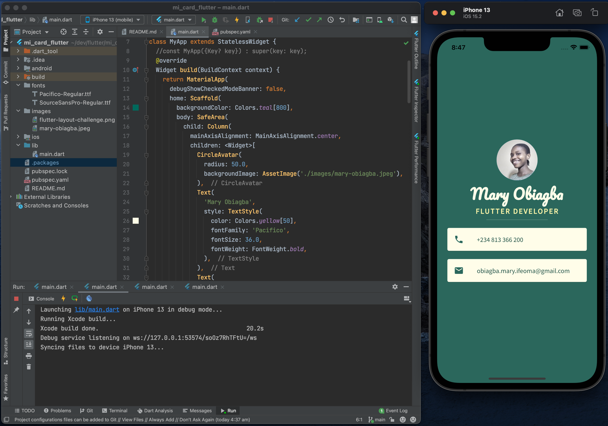
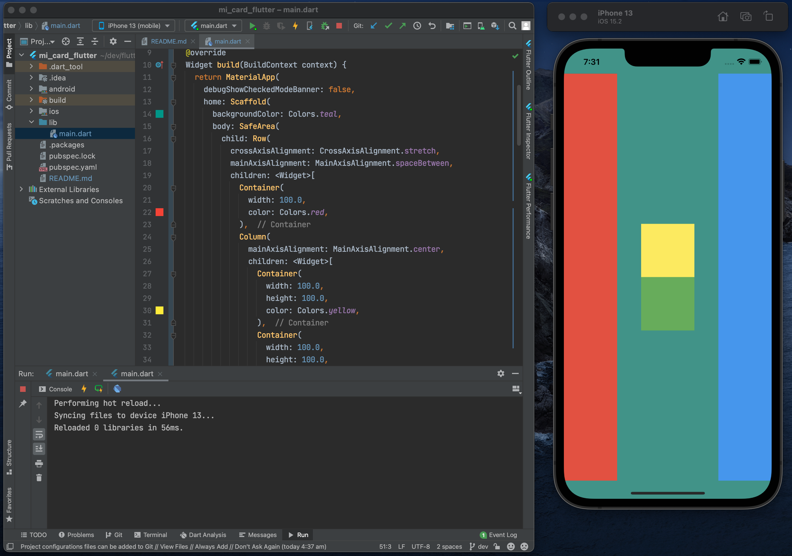

# Mi Card

Mi Card is a personal business card. You get to download my business card as an app.

## Mi card project screenshot



## Flutter layout challenge solution



````
class MyApp extends StatelessWidget {
  //const MyApp({Key? key}) : super(key: key);
  @override
  Widget build(BuildContext context) {
    return MaterialApp(
      debugShowCheckedModeBanner: false,
      home: Scaffold(
        backgroundColor: Colors.teal,
        body: SafeArea(
          child: Row(
            crossAxisAlignment: CrossAxisAlignment.stretch,
            mainAxisAlignment: MainAxisAlignment.spaceBetween,
            children: <Widget>[
              Container(
                width: 100.0,
                color: Colors.red,
              ),
              Column(
                mainAxisAlignment: MainAxisAlignment.center,
                children: <Widget>[
                  Container(
                    width: 100.0,
                    height: 100.0,
                    color: Colors.yellow,
                  ),
                  Container(
                    width: 100.0,
                    height: 100.0,
                    color: Colors.green,
                  ),
                ],
              ),
              Container(
                width: 100.0,
                color: Colors.blue,
              ),
            ],
          ),
        ),
      ),
    );
  }
}

````
